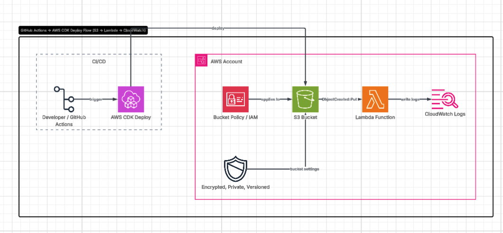

# Sixth Street S3 Event Processor

This repository contains an AWS CDK v2 Python application that deploys:

- An encrypted, private, versioned S3 landing bucket
- An explicit S3 bucket policy that denies non-TLS access
- A Python 3.12 Lambda function that processes `ObjectCreated` events
- S3 event notifications for files landing under the `inbound/` prefix
- Least-privilege Lambda read access to the bucket
- CloudWatch log retention
- A basic GitHub Actions deployment workflow

## Architecture


I utilized Lucidchart instead of Excalidraw to draw/design the flowchart, so I use the familiar one.https://lucid.app/lucidchart/10c58d99-3eba-49ce-a483-01d5d52fab5a/edit?beaconFlowId=6E3D1B6F102A599E&invitationId=inv_e020a25a-6490-4617-b91e-ec147816a36a&page=0_0#

## Flow

1. A developer/user uploads a single-line file to `s3://<landing-bucket>/inbound/<file>`.
2. S3 emits an `ObjectCreated` event.
3. Lambda receives the event and reads the object from S3.
4. Lambda validates that the file has exactly one line.
5. Lambda parses the line as JSON, key/value CSV, or plain text.
6. Lambda writes structured success or failure logs to CloudWatch Logs.

## Repository layout

```text
.
├── app.py
├── cdk.json
├── requirements.txt
├── requirements-dev.txt
├── README.md
├── diagrams/
│   ├── architecture.excalidraw
│   └── architecture.svg
├── lambda/
│   └── processor.py
├── sixthstreet/
│   ├── __init__.py
│   └── s3_event_processor_stack.py
├── tests/
│   └── test_processor.py
└── .github/workflows/
    └── deploy.yml
```

## Prerequisites

- Python 3.12 recommended
- Node.js 20+
- AWS CDK CLI v2
- AWS credentials with permission to deploy CloudFormation, S3, Lambda, IAM, and CloudWatch Logs resources

## Local setup

```bash
git clone https://github.com/mabayajoe/sixthstreet.git
cd sixthstreet
python3 -m venv .venv
source .venv/bin/activate
python -m pip install --upgrade pip
pip install -r requirements-dev.txt
npm install -g aws-cdk
```

## Run tests

```bash
pytest -q
```

## Synthesize CloudFormation

```bash
cdk synth
```

## Bootstrap the AWS account

Run this once per AWS account/region before the first CDK deployment:

```bash
cdk bootstrap aws://ACCOUNT_ID/REGION
```

Example:

```bash
cdk bootstrap aws://123456789012/us-east-1
```

## Deploy

```bash
cdk deploy
```

## Test the deployed stack

After deployment, find the generated S3 bucket name from the CloudFormation outputs or AWS console, then upload a single-line test file to the `inbound/` prefix.

### JSON example

```bash
echo '{"account_id":"12345","amount":42.50,"status":"NEW"}' > sample.json
aws s3 cp sample.json s3://BUCKET_NAME/inbound/sample.json
```

### Key/value example

```bash
echo 'account_id=12345,amount=42.50,status=NEW' > sample.txt
aws s3 cp sample.txt s3://BUCKET_NAME/inbound/sample.txt
```

### Plain-text example

```bash
echo 'hello-sixth-street' > plain.txt
aws s3 cp plain.txt s3://BUCKET_NAME/inbound/plain.txt
```

Then inspect the Lambda log group in CloudWatch Logs.

## GitHub Actions deployment

The workflow in `.github/workflows/deploy.yml` supports manual deployment and deployment on pushes to `main`.

Recommended production approach:

1. Create an AWS IAM role trusted by GitHub OIDC.
2. Grant that role deployment permissions scoped to this CDK stack.
3. Add the role ARN as a GitHub repository secret named `AWS_DEPLOY_ROLE_ARN`.
4. Trigger the workflow manually using `workflow_dispatch` or push to `main`.

## Maintenance notes

- Keep `aws-cdk-lib` current in `requirements.txt`.
- Keep Lambda runtime current as AWS releases newer supported Python runtimes.
- Add alarms for Lambda errors, throttles, and duration before production use.
- Consider adding an SQS dead-letter queue if failed records should be retried or replayed.
- Consider adding S3 lifecycle policies if the landing bucket will receive high volume.
- Keep the S3 bucket retained by default to prevent accidental data deletion during stack teardown.

## Design decisions

- **S3 prefix filter:** only objects under `inbound/` trigger Lambda, which avoids invoking the function for unrelated objects.
- **Secure bucket defaults:** the bucket blocks public access, enables S3-managed encryption, enforces SSL, and uses versioning.
- **Explicit bucket policy:** the stack includes a deny statement for non-secure transport to make the security control visible in code review.
- **Least privilege:** Lambda receives read-only access to the landing bucket.
- **Operational safety:** bucket removal policy is `RETAIN`, preventing accidental data deletion if the stack is destroyed.
- **Simple parser:** the function supports JSON, `key=value` CSV, and plain text for easy walkthrough and testing.

## Questions to confirm with the team

- Should invalid multi-line files fail the Lambda invocation, or should they be moved to a quarantine/error prefix?
- Should the parser emit results to another target such as DynamoDB, SQS, EventBridge, or another S3 prefix?
- Should the bucket be customer-managed KMS encrypted instead of S3-managed encrypted?
- Are there naming conventions, tagging standards, or account/region restrictions Sixth Street wants followed?
- Should the deployment workflow use dev/stage/prod environments with approvals?
